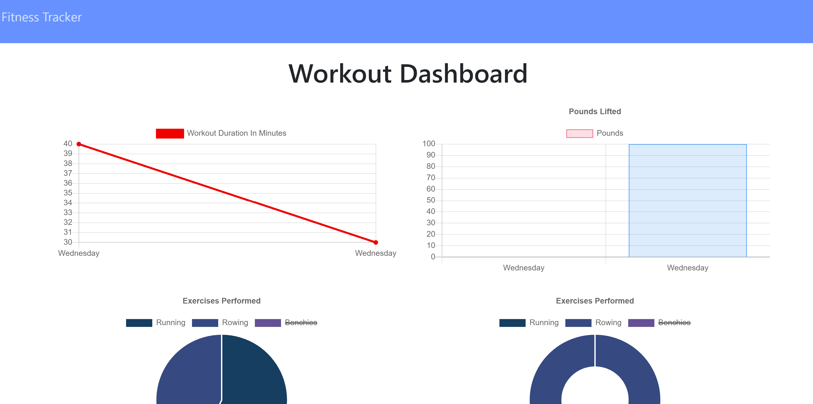

# Workout Tracker

## Table of Contents
> - [Description](#Description)
> - [Table of Contents](#Table-of-Contents)
> - [Installation](#Installation)
> - [Usage](#Usage)
> - [License](#License)
> - [Contributing](#Contributing)
> - [Tests](#Tests)
> - [Questions](#Questions)

## Description
Create the routes, API's, and MongoDB to power the prebuilt workout tracker.

* [View the deployed app on Heroku](https://cryptic-reaches-74555.herokuapp.com/)
* [View it on GitHub](https://github.com/FSC-Portfolio/workout-tracker)
* [View my portfolio](http://jayarghargh.com)

## Installation
Clone the repo, navigate to the root folder, run npm install, ensure you have mongodb installed and configured.
## Usage
`npm run watch`
## License
This application is covered under The MIT License.
## Contributing
Please report all bugs
## Tests
NA
## Questions
Please refer any questions to  via jayarghargh@gmail.com.

>  This README.md created with .
